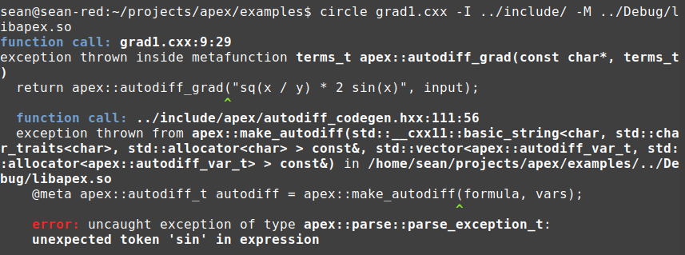

# Reverse-mode automatic differentiation with Circle and Apex

```cpp
struct terms_t {
  double x;
  double y;
};

terms_t my_grad(terms_t input) {
  return apex::autodiff_grad("sq(x / y) * sin(x * y)", input);
}
```

This example shows how to leverage the Apex DSL library to implement reverse-mode automatic differentation. The expression to differentiate is passed in as a compile-time string, and the primary inputs are provided as a vector of strings.

This illustrates shared object library development. There are three things you can count on:
1. No template metaprogramming.
1. No operator overloading.
1. No performance compromise.

Do all your development in an ordinary C++/Circle shared object project. Call into this shared object library during source translation and capture the returned IR. Lower the IR to code using Circle macros. This is a new way forward for DSLs in C++.

## Expression templates

In Standard C++, code must either be included in textual form or compiled to binary and linked with the program. Only the former form is generic--template libraries may be specialized to solve an application-specific problem.

EDSLs have been attempted by the C++ community for almost twenty years. In Standard C++, the [expression template](https://en.wikipedia.org/wiki/Expression_templates) idiom is used to repurpose the C++ syntax as a domain-specific language. Operator overloading and template metaprogramming are combined to capture the result of a subexpression as a _type_. For example, if either terminal in the subexpression `a + b` is an EDSL type, the result object of the addition expression is a type that includes details of the operator and of each operand. For example, `op_add_t<left_type, right_type>`, where the template arguments are EDSL operator types that recursively specify their operand types. The type of the result object for the full expression contains the information of a parse tree over that same expression input. The expression template may be traversed (as if one were traversing a parse tree) and some calculation performed at each node.

Expression templates are extremely difficult to write, error messages are opaque (mostly due to the hierarchical nature of the involved types) and build times are long. Most critically, expression-template EDSLs don't allow very complex compile-time transformations on the parse tree content. Once the expression template is built, the user remains limited by C++'s lack of compile-time imperative programming support. The user cannot lower the expression template to a rational IR, or build tree data structures, or run the content through optimizers or analyzers.

## The Apex vision for libraries

Circle's integrated interpreter and code reflection mechanisms establish a larger design space for libraries. _What is a library with Circle?_ **Any code that provides a service**.

As demonstrated with the [Tensor Compiler example](https://github.com/seanbaxter/circle/blob/master/gems/taco.md), a Circle program can dynamically link to a shared object library _at compile time_, use that library to solve an intricate problem (tensor contraction scheduling), then lower the resultin solution (the intermediate representation) to code using Circle's macro system.

Apex is a collection of services to help programmers develop this new form of library. Currently it includes a tokenizer and parser for a C++ subset (called the Apex grammar), as well as a reverse-mode automatic differentation package that serves as both an example for building new libraries and an ingredient for additional numerical computing development.

Functionality built using Apex presents itself to the application developer as an _embedded domain-specific language_. But the design of Apex EDSLs is very different from the design of expression templates: there is no operator overloading; there is no template metaprogramming; we don't try to co-opt C++ tokens into carrying DSL information.

The client communicates with the library by way of compile-time strings. The contents may be provided as literals or assembled from code and data using Circle's usual compile-time mechanisms. The library transforms the input text into code:

1. The Apex tokenizer lexes the text into tokens. The tokenizer code is in the shared object library `libapex.so`.
1. The Apex parser processes the tokens into a parse tree. The parser code is also in `libapex.so`. The parse tree is an light-weight class hierarchy. There are node types for unary and binary operators, function calls, terminals, and so on. It is not a template library.  
    Parse errors are formed by the parser--you don't get C++ frontend errors when the input is malformed, but Apex backend errors, which are cleaner and more relevant to the problem of parsing.
1. The EDSL library traverses the parse tree and performs semantic analysis. This is where the library intelligence resides. All usual programming tools are available to the library. It can interact with the file system, host interpreters to execute scripts, and so on. The library intelligence should be compiled into a shared object; Apex's autodiff package is compiled into `libapex.so`.  
    The output of the intelligence layer is the problem solution in an intermediate representation. This IR may be expressed using any C++ data structure. Because the library's shared object is loaded into the compiler's process during source translation, objects created by the intelligence layer occupy the same address space as the Circle interpreter, allowing those objects to be consumed and modified by meta code.
1. A codegen header supplies the interface between the client, the Apex tokenizer and parser, and the library intelligence. This header provides Circle macros to lower the EDSL operation from IR to expression code. 

Although this seems like an involved four-step pipeline, the first two components are reusable and provided by libraries. Even if you choose a different tokenizer or parser, you can use them from libraries. The intelligence layer establishes a nice separation of concerns, as you can develop it independently of the code generator. Finally, the codegen layer is very small, as all difficult work was pushed down and handled by shared object libraries.

A strength of this approach is that it requires very little Circle code, only a thin layer of macros for code generation. All the intelligence can be written with Standard C++ for portability and to ease migration into this new language.

## Autodiff for Circle

```cpp
#include <apex/autodiff_codegen.hxx>

struct terms_t {
  double x;
  double y;
};

terms_t my_grad(terms_t input) {
  return apex::autodiff_grad("sq(x / y) * sin(x * y)", input);
}

int main() {
  terms_t grad = my_grad( { .3, .5 } );
  printf("%f %f\n", grad.x, grad.y);
  return 0;
}
```
```
$ circle grad1.cxx -I ../include -M ../Debug/libapex.so 
$ ./grad1
1.053170 0.425549
```

To use Apex's autodiff, pass the formula to differentiate as a string, followed by a class object with the values of each primary input. The names referenced in the formula must correspond to the member names in the class object. We'll use Circle's type introspection to help relate the type information to the variable names.

The result object is another instance of the class type, this time holding the partial derivatives rather than the values of the independent variables.

After just two days of programming, this package supports these expressions and elementary functions:
* Binary + - * and /.
* Unary -.
* sq, sqrt, exp, log, sin, cos, tan, sinh, cosh, tanh, pow and norm functions.

The call to `autodiff_grad` has distinct compile-time and runtime phases. At compile time, the formula is tokenized and parsed; the parse tree is lowered by `make_autodiff` to an IR called a "tape," and that tape is lowered by `autodiff_codegen.hxx` to code using Circle macros. At runtime, the independent variables are evaluated and the tape-generated code is executed, yielding the gradient. All scheduling is performed at compile time, and there is no runtime dependency on any part of the `libapex.so` library.

Reverse-mode differentation is essentially a sparse matrix problem. Each dependent variable/subexpression is a row in the sparse matrix (an item in the tape) with a non-zero column for each partial derivative we'll compute to complete the chain rule. When considered as a DAG traversal, the chain rule calculation involves propagating partials from the root down each edge, and incrementing a component of the gradient vector by the concatenated chain rule coefficient. When viewed as linear algebra, the entire gradient pass is a sparse back-propagation operation. 

The Apex autodiff example adopts the DAG view of the problem. The implementation performs best when the size of the DAG is small enough so that the gains of explicit scheduling of each individual back-propagation term more than offset the parallelism left on the table by not using an optimized sparse matrix back-propagation code.

However, the separation of autodiff intelligence and code generation permits selection of a back-propagation treatment most suitable for the particular primary inputs and expression graph. Calls into the autodiff library with different expressions may generate implementations utilizing different strategies, without the vexations of template metaprogramming.

## Writing an embedded DSL for Circle programs

How do we implement the autodiff DSL? We basically write our own small compiler frontend--it takes text input, performs syntax and semantic analysis, and emits IR, just like a general-purpose compiler. 

This would be too much work if written from scratch for each DSL library. We'll use the language components available in Apex to tokenize and parse the input text into a parse tree for the _Apex grammar_ (a C++-inspired expression grammar), and consume the parse tree as configuration for the library. 

### The tokenizer

Apex includes a tokenizer that breaks an input text into operators (all the ones recognized by C++) and identifiers.

[**tokens.hxx**](../include/apex/tokens.hxx)
```cpp
struct token_t {
  tk_kind_t kind : 8;
  int store : 24;
  const char* begin, *end;

  operator tk_kind_t() const { return kind; }
};
typedef const token_t* token_it;
```

The token structure holds an enumeration defining the kind of token (eg '+' token, integer token or identifier token) and an index into a store to retrieve a resource, like a string, integer or floating-point value.

[**tokenizer.hxx**](../include/apex/tokenizer.hxx)
```cpp
struct tokenizer_t {
  std::vector<std::string> strings;
  std::vector<uint64_t> ints;
  std::vector<double> floats;

  // Byte offset for each line start.
  std::vector<int> line_offsets;

  // Original text we tokenized.
  std::string text;

  // The text divided into tokens.
  std::vector<token_t> tokens;

  parse::range_t token_range() const;

  int reg_string(range_t range);
  int find_string(range_t range) const;

  // Return 0-indexed line and column offsets for the token at
  // the specified byte offset. This performs UCS decoding to support
  // multibyte characters.
  int token_offset(source_loc_t loc) const;
  int token_line(int offset) const;
  int token_col(int offset, int line) const;
  std::pair<int, int> token_linecol(int offset) const;
  std::pair<int, int> token_linecol(source_loc_t loc) const;
 
  void tokenize();
};
```

The `tokenizer_t` class holds the input text, the array of tokens, the resources, and an array of line offsets to ease mapping between tokens and line/column positions within the input text. The tokenizer expects UTF-8 input, so characters may consume between one and four bytes; the `token_linecol` functions map token indices and byte offsets within the text to the correct line/column positions, accounting for these multi-byte characters.

To use the tokenizer, set the `text` data member and call the `tokenize` member function.

### The parser

The parser consumes tokens from left-to-right and constructs a parse tree from bottom-to-top. Apex includes a hand-written recursive descent (RD) parser, which is the most practical and flexible approach to parsing.

[**parse.hxx**](../include/apex/parse.hxx)
```cpp
struct node_t {
  enum kind_t {
    kind_ident,
    kind_unary,
    kind_binary,
    kind_assign,
    kind_ternary,
    kind_call,
    kind_char,
    kind_string,
    kind_number,
    kind_bool,
    kind_subscript,
    kind_member,
    kind_braced,
  };

  kind_t kind;
  source_loc_t loc;

  node_t(kind_t kind, source_loc_t loc) : kind(kind), loc(loc) { }
  virtual ~node_t() { }

  template<typename derived_t>
  derived_t* as() {
    return derived_t::classof(this) ? 
      static_cast<derived_t*>(this) : 
      nullptr;
  }

  template<typename derived_t>
  const derived_t* as() const {
    return derived_t::classof(this) ? 
      static_cast<const derived_t*>(this) : 
      nullptr;
  }
};
typedef std::unique_ptr<node_t> node_ptr_t;
typedef std::vector<node_ptr_t> node_list_t;
```

Each parse tree node derives `apex::parse::node_t`. `source_loc_t` is the integer index of the token from which the parse node was constructed, and we include one in each parse node. The tokenizer object can map `source_loc_t` objects back to line/column numbers for error reporting.

The full implementation of the parser is in [grammar.cxx](../src/parse/grammar.cxx). We'll run the parser at compile time from a meta context in the Circle program. But unlike a template, which is C++ generic programming offering, _we don't need to see the source of the parser_ from the source code of the client. The parser is compiled into `libapex.so`, and the Circle interpreter will make a foreign function call to run the parser and retrieve the parse tree. We don't even need access to `libapex.so` at runtime--the IR from the DSL library is lowered to Circle code during compile time, and the resulting binary retains no evidence of `libapex.so`'s role in its generation.

[**parse.hxx**](../include/apex/parse.hxx)
```cpp
struct parse_t {
  tok::tokenizer_t tokenizer;
  node_ptr_t root;
};

parse_t parse_expression(const char* str);
```

Calling `apex::parse::parse_expression` tokenizes and parses an input text and returns both the tokenizer (which has line-mapping content) and the root node of the parse tree. `node_ptr_t` is an `std::unique_ptr`; when the user destroys the root object from meta code, the entire tree is recursively destroyed from the smart pointers' destructors.

### The autodiff IR

The autodiff library traverses the parse tree and builds a data structure called a _tape_ or _Wengert list_, which includes instructions for evaluating the value and partial derivatives for each subexpression.

[**autodiff.hxx**](../include/apex/autodiff.hxx)
```cpp
struct autodiff_t {
  struct item_t {
    // The dimension of the tape item. 
    // 0 == dim for scalar. dim > 0 for vector.
    int dim;

    // The expression to execute to compute this dependent variable's value.
    // This is evaluated during the upsweep when creating the tape from the 
    // independent variables and moving through all subexpressions.
    ad_ptr_t val;

    // When updating the gradient of the parent, this tape item loops over each
    // of its dependent variables and performs a chain rule increment.
    // It calls grad(index, coef) on each index. This recurses, down to the
    // independent vars, multiplying in the coef at each recurse. 

    // When we hit an independent var, the grads array is empty (although it
    // may be empty otherwise) and we simply perform += coef into the slot
    // corresponding to the independent variable in the gradient array.
    struct grad_t {
      int index;
      ad_ptr_t coef;
    };
    std::vector<grad_t> grads;
  };

  // The first var_names.size() items encode independent variables.
  std::vector<autodiff_var_t> vars;
  std::vector<item_t> tape;
};

autodiff_t make_autodiff(const std::string& formula, 
  const std::vector<autodiff_var_t>& vars);
```

The result object of `make_autodiff` is an object of type `autodiff_t`. This holds the _tape_, and each tape item holds expressions to evaluating the tape's subexpression and that subexpression's gradient. The index in each gradient component refers to a position within the tape corresponding to the variable (dependent or independent) that the partial derivative is computed with respect to. When traversing the tape DAG, we concatenate partial derivatives; when we hit a terminal node (an independent variable), we increment the output gradient by the total derivative--this is the chain rule in action.

Although the DSL doesn't yet support it, the tape is designed to accomodate vector types in addition to scalar types.

The autodiff IR needs to be comprehensive enough to encode any operations found in the expression to differentiate. We chose the design for easy lowering using intrinsics like `@op` and `@expression` to generate code from strings.

[**autodiff.hxx**](../include/apex/autodiff.hxx)
```cpp
struct ad_t {
  enum kind_t {
    kind_tape,
    kind_literal,
    kind_unary,
    kind_binary,
    kind_func
  };
  kind_t kind;
  
  ad_t(kind_t kind) : kind(kind) { }

  template<typename derived_t>
  derived_t* as() {
    return derived_t::classof(this) ? 
      static_cast<derived_t*>(this) : 
      nullptr;
  }

  template<typename derived_t>
  const derived_t* as() const {
    return derived_t::classof(this) ? 
      static_cast<const derived_t*>(this) : 
      nullptr;
  }
};
typedef std::unique_ptr<ad_t> ad_ptr_t;

struct ad_tape_t : ad_t {
  ad_tape_t(int index) : ad_t(kind_tape), index(index) { }
  static bool classof(const ad_t* ad) { return kind_tape == ad->kind; }

  int index;
};

struct ad_literal_t : ad_t {
  ad_literal_t(double x) : ad_t(kind_literal), x(x) { }
  static bool classof(const ad_t* ad) { return kind_literal == ad->kind; }

  double x;
};

struct ad_unary_t : ad_t {
  ad_unary_t(const char* op, ad_ptr_t a) :
    ad_t(kind_unary), op(op), a(std::move(a)) { }
  static bool classof(const ad_t* ad) { return kind_unary == ad->kind; }

  const char* op;
  ad_ptr_t a;
};

struct ad_binary_t : ad_t {
  ad_binary_t(const char* op, ad_ptr_t a, ad_ptr_t b) : 
    ad_t(kind_binary), op(op), a(std::move(a)), b(std::move(b)) { }
  static bool classof(const ad_t* ad) { return kind_binary == ad->kind; }

  const char* op;
  ad_ptr_t a, b;
};

struct ad_func_t : ad_t {
  ad_func_t(std::string f) : ad_t(kind_func), f(std::move(f)) { }
  static bool classof(const ad_t* ad) { return kind_func == ad->kind; }

  std::string f;
  std::vector<ad_ptr_t> args;
};
```

The autodiff code in `libapex.so` generates `ad_t` trees into the tape data structure. Each tree node is allocated on the heap and stored in an `std::unique_ptr`. Because the shared object is loaded into the address space of the compiler, the result object of the foreign-function library call is fully accessible to meta code in the translation unit by way of the Circle interpreter. 

As with the tokenizer and parser, the implementation of the autodiff library is totally abstracted from the library's caller. 

The tape-building class `ad_builder_t` in [autodiff.cxx](../src/autodiff/autodiff.cxx) has member functions for each operation and elementary function supported by the DSL. For example, to support multiplication we implement the product rule of calculus:

```cpp
int ad_builder_t::mul(int a, int b) {
  // The sq operator is memoized, so prefer that.
  if(a == b)
    return sq(a);

  // grad (a * b) = a grad b + b grad a.
  item_t item { };
  item.val = mul(val(a), val(b));
  item.grads.push_back({
    b,      // a * grad b
    val(a)
  });
  item.grads.push_back({
    a,      // b * grad a
    val(b)
  });
  return push_item(std::move(item));
}
```

The operands are indices to lower nodes in the tape. We use function overloads like `mul` and `val` to create `ad_t` nodes, which are assembled recursively into expression trees.

```cpp
int ad_builder_t::sin(int a) {
  item_t item { };
  item.val = func("std::sin", val(a));
  item.grads.push_back({
    a,
    func("std::cos", val(a))
  });
  return push_item(std::move(item));
}
```

The sine function is supported with a similar member function. We generate `ad_func_t` nodes which identify the functions to call by string name. When the IR is lowered to code in [autodiff_codegen.hxx](../include/apex/autodiff_codegen.hxx), we'll use `@expression` to perform name lookup and convert these qualified names to function lvalues.

Note that we can deliver a rich calculus package without having to define a type system to interact with the rest of the C++ application. We don't have to require that `sin` and `cos` implement any particular concept or interface to participate in differentiation, because these are first-class functions supported by the DSL.

To allow user-extension to the autodiff library, such as user-defined functions, any convention may be used to communicate between the library and the client. A participating function and its derivative could adopt a particular naming convention (e.g., the function ends with `_f` and the derivative ends with `_grad`); the function and derivative could be member functions of a class that is named in the input string (e.g., naming "sinc" in the formula string performs name lookup for class `sinc_t` and calls member functions `f` and `grad`)

The strength of this design is that you aren't relying on C++'s overload resolution and type systems to coordinate between the library's implementation and its users; the library can introduce its own conventions for interoperability.

## The autodiff code generator

[**autodiff_codegen.hxx**](../include/apex/autodiff_codegen.hxx)
```cpp
template<typename type_t>
@meta type_t autodiff_grad(@meta const char* formula, type_t input) {

  // Parse out the names from the inputs.
  static_assert(std::is_class<type_t>::value, 
    "argument to autodiff_eval must be a class object");

  // Collect the name of each primary input.
  @meta std::vector<autodiff_var_t> vars;
  @meta size_t num_vars = @member_count(type_t);

  // Copy the values of the independent variables into the tape.
  double tape_values[num_vars];
  @meta for(int i = 0; i < num_vars; ++i) {
    // Confirm that we have a scalar double-precision term.
    static_assert(std::is_same<@member_type(type_t, i), double>::value,
      std::string("member ") + @member_name(type_t, i) + " must be type double");

    // Push the primary input name.
    @meta vars.push_back({
      @member_name(type_t, i),
      0
    });

    // Set the primary input's value.
    tape_values[i] = @member_ref(input, i);
  }

  // Construct the tape. This makes a foreign function call into libapex.so.
  @meta apex::autodiff_t autodiff = apex::make_autodiff(formula, vars);
  @meta size_t count = autodiff.tape.size();

  // Compute the values for the whole tape. This is the forward-mode pass. 
  // It propagates values from the terminals (independent variables) through
  // the subexpressions and up to the root of the function.

  // Evaluate the subexpressions.
  @meta for(size_t i = num_vars; i < count; ++i)
    tape_values[i] = autodiff_expr(autodiff.tape[i].val.get());

  // Evaluate the gradients. This is a top-down reverse-mode traversal of 
  // the autodiff DAG. The partial derivatives are parsed along edges, starting
  // from the root and towards each terminal. When a terminal is visited, the
  // corresponding component of the gradient is incremented by the product of
  // all the partial derivatives from the root of the DAG down to that 
  // terminal.
  double coef[num_vars];
  type_t grad { };

  // Visit each child of the root node.
  @meta int root = count - 1;
  @meta for(const auto& g : autodiff.tape[root].grads) {
    // Evaluate the coefficient into the stack.
    coef[root] = autodiff_expr(g.coef.get());

    // Recurse on the child.
    @macro autodiff_tape(g.index, root);
  }

  return std::move(grad);
}
```

`autodiff_grad` is implemented as a metafunction. Recall that these are like super function templates: some parameters are marked `@meta`, requiring compile-time arguments be provided. By making the input formula string `@meta`, we can pass the string to `apex::make_autodiff` at compile time to generate an IR. This function is implemented in `libapex.so`, so `-M libapex.so` must be specified as a `circle` argument to load this shared object library as a dependency.

After the tape has been computed and returned, we first initialize the tape values in forward order (that is, from the leaves of the expression tree up to the root). Then, we may the reverse pass, propagating partial derivatives from the root of the expression tree down to the terminals, where the gradient is finally updated.

Although the values in the tape will be used again during the top-down gradient pass, their storage may be a performance limiter in problems with a very large number of temporary nodes. Because the library defines its own IR and scheduling intelligence, it's feasible to extend the IR and emit instructions to rematerialize temporary values to alleviate storage pressure. 

[**autodiff_codegen.hxx**](../include/apex/autodiff_codegen.hxx)
```cpp
@macro auto autodiff_expr(const ad_t* ad) {
  @meta+ if(const auto* tape = ad->as<ad_tape_t>()) {
    @emit return tape_values[tape->index];

  } else if(const auto* literal = ad->as<ad_literal_t>()) {
    @emit return literal->x;

  } else if(const auto* unary = ad->as<ad_unary_t>()) {
    @emit return @op(
      unary->op, 
      autodiff_expr(unary->a.get())
    );

  } else if(const auto* binary = ad->as<ad_binary_t>()) {
    @emit return @op(
      binary->op, 
      autodiff_expr(binary->a.get()), 
      autodiff_expr(binary->b.get())
    );

  } else if(const auto* func = ad->as<ad_func_t>()) {
  	// Support 1- and 2-parameter function calls.
    if(1 == func->args.size()) {
      @emit return @expression(func->f)(autodiff_expr(func->args[0].get()));

    } else if(2 == func->args.size()) {
      @emit return @expression(func->f)(autodiff_expr(func->args[0].get()),
        autodiff_expr(func->args[1].get()));
    }
  }
}
```

The expression macro `autodiff_expr` recurses an `ad_t` tree and switches on each node kind. 

* The macro is expanded in the scope of the caller, so the `tape_values` object is visible; this provides access to the value of each subexpression.
* The unary and binary nodes hold strings with the operator names, such as "+" or "/". We can pass these strings to `@op` along with the expression arguments to synthesize the corresponding kind of expression.
* Function call nodes have the _name_ of the function stored as a string. When evaluated with `@expression`, name lookup is performed on the qualified name (eg, "std::cos") and returns a function lvalue or overload set.

Each tape item (corresponding to sparse matrix row) includes one `ad_t` tree that renders the value of the subexpression, and one `ad_t` per child node in the DAG to compute partial derivatives. The values are computed in bottom-up order (forward through the tape), and the partial derivatives are computed in top-down order (reverse mode through the tape). An optimization potential may be exposed by evaluating all partial derivatives in parallel (there are no data dependencies between them), and using a parallelized sparse back-propagation code to concatenate the partial derivatives. Again, these choices should be made by the intelligence of the library, which is well-separated from the metaprogramming concerns of the code generator.

## DSL error reporting

Circle has been adding capability for better integration of compile-time exceptions with compiler errors. If an exception is thrown either from the Circle interpreter or from a foreign function call to a dynamically-loaded shared object, a backtrace for the unhandled exception is printed along with the exception's error. This helps us understand exactly where and why the error was generated.

Consider breaking the syntax of our Apex autodiff function:
```cpp
terms_t my_grad(terms_t input) {
  return apex::autodiff_grad("sq(x / y) * 2 sin(x)", input);
}
```

The Apex grammar doesn't support this kind of implicit multiplication. The `sin` call is simply an unexpected token, so our parser throws an exception indicating such:

[**grammar.cxx**](../src/parse/grammar.cxx)
```cpp
void grammar_t::unexpected_token(token_it pos, const char* rule) {
  const char* begin = pos->begin;
  const char* end = pos->end;
  int len = end - begin;

  std::string msg = format("unexpected token '%.*s' in %s", len, begin, rule);

  throw parse_exception_t(msg);
}
```

This exception originates in compiled code, and unrolls the stack through the foreign function call to `apex::make_autodiff`, through the entire Circle compiler, until it is finally caught from Circle's `main` function and printed as an uncaught exception. Wonderfully, Circle constructs backtrace information as this exception unrolls through function calls and macro expansions, and presents the backtrace as compiler errors:



The text saved in the `parse_exception_t` class (which derives `std::runtime_error`, which is how we access its error message) is printed in the most-indented part of the error. Around that, we're shown that it's thrown from `apex::make_autodiff` from `libapex.so`. In turn, that function call is made from inside the instantiation of the metafunction `apex::autodiff_grad`. The offending string is shown here, and we can see the call to `sin` which corresponds to the parse error thrown from inside Apex.

The backtrace will print the full path of functions called, regardless of if they are called from interpreted or compiled code. Additionally, the _throw-expression_ generating the exception is flagged:

**test.cxx**
```cpp
#include <stdexcept>

void func1() {
  throw std::runtime_error("A bad bad thing");  
}

void func2() {
  func1();
}

void func3() {
  func2();
}

@meta func3();
```


